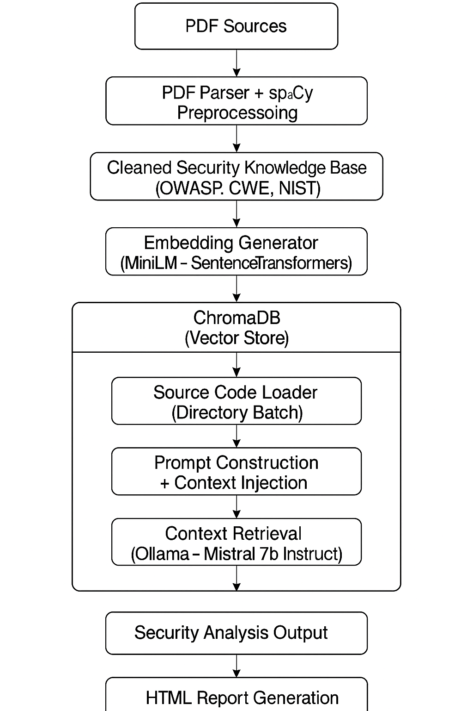
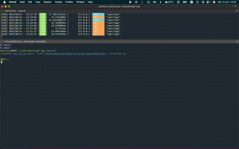

# SovereignRAG

**Sovereign Retrieval Augmented Generation for Secure Code Analysis**

[](LICENSE)
[](https://www.python.org/)
[](https://github.com/spacexnu/sovereign-rag/actions/workflows/build.yml)

---

🚀 Open-source sovereign RAG engine for security code auditing.

- 100% offline
- Runs on personal hardware (Apple M1 fully supported)
- Uses LLMs like phi3, mistral, codellama via Ollama
- Vector DB via ChromaDB
- Preprocessing with spaCy for efficient semantic chunking
- BSD 3-Clause License

---




## Philosophy

Sovereign AI - private, secure, under full control.

This project is part of a broader experiment applying sovereign AI pipelines for security code analysis.
It's a fully private, offline, sovereign AI pipeline for security code auditing. 
Free from cloud lock-in, vendor tracking or corporate surveillance.

Build your own lab. Own your models. Control your data.


---

## Install

This project is designed to run via Docker. The Makefile wraps the common Docker Compose commands.

Requirements:

- Docker and Docker Compose

Optional (local dev only):

- Python 3.10+
- Ollama

Optional (local dev only, CLI entry point):

```bash
pip install -e .
sovereign-rag --help
```

Build images:

```bash
make build
```

## Usage (Docker)

SovereignRAG provides a unified CLI interface with colored output for better readability. There are two main commands:

### Ingest PDF Documents

To ingest security-related PDF documents into the vector database:

```bash
make ingest PDF_DIR=./raw_pdfs MODEL=all-MiniLM-L6-v2
```

Options:
- `--pdf-dir`: Directory containing PDF files to index (default: ./raw_pdfs/)
- `--model`: Sentence transformer model to use (default: all-MiniLM-L6-v2)

Example:
```bash
make ingest PDF_DIR=./security_pdfs MODEL=all-MiniLM-L6-v2
```

### Query for Security Analysis

To analyze a source code file for security vulnerabilities:

```bash
make query PATH=./src/sovereign_rag/query.py EXT=py MODEL=qwen2.5:3b-instruct
```

Options (via Makefile vars):
- `PATH`: Path to the source code file or directory to analyze (required)
- `EXT`: File extension filter when PATH is a directory (optional)
- `MODEL`: Ollama model to use (default: qwen2.5:3b-instruct)
- `OLLAMA_URL`: Ollama API URL (default: http://ollama:11434)

### Makefile helpers

Common tasks:

```bash
make up
make pull-model MODEL=qwen2.5:3b-instruct
make ingest PDF_DIR=./raw_pdfs MODEL=all-MiniLM-L6-v2
make query PATH=./src EXT=py MODEL=qwen2.5:3b-instruct
make down
```


## Docker (manual)

If you prefer raw Docker Compose commands instead of the Makefile:

```bash
docker compose build
docker compose up -d ollama
docker compose exec ollama ollama pull qwen2.5:3b-instruct
docker compose run --rm app env PYTHONPATH=src python -m sovereign_rag.cli ingest --pdf-dir ./raw_pdfs --model all-MiniLM-L6-v2
docker compose run --rm app env PYTHONPATH=src python -m sovereign_rag.cli query --path ./src --extension py --model qwen2.5:3b-instruct --ollama-url http://ollama:11434
docker compose down
```

Outputs and data persistence:

- ChromaDB data: `./chroma_db` (host) is mounted to `/app/chroma_db` (container)
- Reports: `./output` (host) is mounted to `/app/output` (container)
- PDFs: `./raw_pdfs` (host) is mounted to `/app/raw_pdfs` (container)

Stop services:

```bash
docker compose down
```

### Docker: Development image (requirements-dev)

Use the dev image to get `pytest`, `ruff`, and other developer tools from `requirements/requirements_dev.txt`.

Build and open a shell in the dev container:

```bash
docker compose build app-dev
docker compose run --rm app-dev bash
```

Inside the dev container, run common tasks:

```bash
# Format
ruff format .

# Lint
ruff check .

# Tests
pytest -q

# App commands (same as prod), pointing to Ollama service
PYTHONPATH=src python -m sovereign_rag.cli ingest --pdf-dir ./raw_pdfs/ --model all-MiniLM-L6-v2
PYTHONPATH=src python -m sovereign_rag.cli query --path ./src --extension py --model qwen2.5:3b-instruct --ollama-url http://ollama:11434
```

## Development (local, optional)

### Code Formatting

This project uses [ruff](https://github.com/astral-sh/ruff) for code formatting. To format all Python files in the project, run:

```bash
ruff format .
```

This will automatically format your code according to the style defined in the pyproject.toml file.
