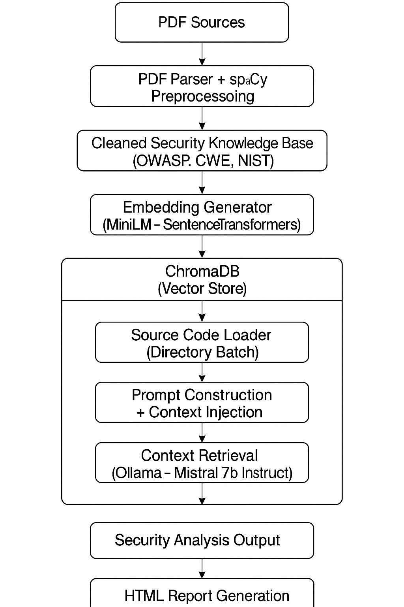
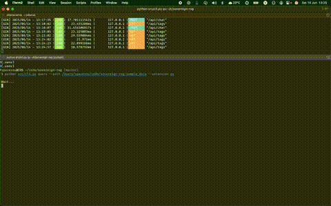

# SovereignRAG

**Sovereign Retrieval Augmented Generation for Secure Code Analysis**

[](LICENSE)
[](https://www.python.org/)
[](https://github.com/spacexnu/sovereign-rag/actions/workflows/build.yml)
[](https://spacexnu.github.io/sovereign-rag/)

---

🚀 Open-source sovereign RAG engine for security code auditing.

- 100% offline
- Runs on personal hardware (Apple M1 fully supported)
- Uses LLMs like phi3, mistral, codellama via Ollama
- Vector DB via ChromaDB
- Preprocessing with spaCy for efficient semantic chunking
- BSD 3-Clause License

---




## Philosophy

Sovereign AI - private, secure, under full control.

This project is part of a broader experiment applying sovereign AI pipelines for security code analysis.
It's a fully private, offline, sovereign AI pipeline for security code auditing. 
Free from cloud lock-in, vendor tracking or corporate surveillance.

Build your own lab. Own your models. Control your data.


---

## Install

This project is designed to run via Docker. The Makefile wraps the common Docker Compose commands.

Requirements:

- Docker and Docker Compose

Optional (local dev only):

- Python 3.10+
- Ollama

Optional (local dev only, CLI entry point):

```bash
pip install -e .
sovereign-rag --help
```

Build images:

```bash
make build
```

Documentation is published at
[spacexnu.github.io/sovereign-rag](https://spacexnu.github.io/sovereign-rag/) —
see the [Troubleshooting](https://spacexnu.github.io/sovereign-rag/troubleshooting/)
guide for common setup issues (port conflicts, host Ollama, VRAM). Build it locally with:

```bash
make docs-install
make docs-build
make docs-serve
```

## Usage (Docker)

SovereignRAG provides a unified CLI interface with colored output for better readability. There are two main commands:

### Ingest Documents

To ingest security-related documents into the vector database:

```bash
make ingest DOCS_DIR=./raw_pdfs MODEL=all-MiniLM-L6-v2
```

Both `.pdf` and `.md` files in the directory are indexed (most current OWASP docs ship as
Markdown). Markdown markup (headings, code fences, links, emphasis) is stripped before
chunking so only the prose is embedded. The source filename of each chunk is stored as
metadata so it can be cited at query time.

Options:
- `--docs-dir`: Directory containing `.pdf`/`.md` files to index (default: ./raw_pdfs/).
  `--pdf-dir` is kept as a deprecated alias.
- `--model`: Sentence transformer model to use (default: all-MiniLM-L6-v2)

Example:
```bash
make ingest DOCS_DIR=./security_docs MODEL=all-MiniLM-L6-v2
```

### Query for Security Analysis

To analyze a source code file for security vulnerabilities:

```bash
make query QUERY_PATH=./src/sovereign_rag/query.py EXT=py MODEL=qwen2.5:3b-instruct
```

For every vulnerability found, the analysis reports the problem description, a suggested
fix, and the reference source — the indexed document the supporting knowledge was drawn
from. The retrieved sources are also listed per file in the HTML report.

Options (via Makefile vars):
- `QUERY_PATH`: Path to the source code file or directory to analyze (required)
- `EXT`: File extension filter when PATH is a directory (optional)
- `MODEL`: Ollama model to use (default: qwen2.5:3b-instruct)
- `OLLAMA_URL`: Ollama API URL (default: http://ollama:11434)
- `NUM_CTX`: Ollama context window size, e.g. `4096` or `8192` (optional). Lower values use less VRAM so the model fits on the GPU; omit to use the model default.
- `CHANGED_ONLY`: Set to `1` to analyze only files changed in Git.
- `CHANGED_BASE`: Git ref used by `CHANGED_ONLY` (default: `HEAD`). Use `origin/main` or `origin/master` for a pre-push style check.
- `STAGED`: Set to `1` to analyze only staged files. This is intended for pre-commit hooks.

Absolute `QUERY_PATH` values are mounted read-only into the app container at the
same path, which lets you analyze source trees outside this repository.

Example (limit context to keep a 7B model on an 8GB GPU):
```bash
make query QUERY_PATH=./src EXT=py MODEL=qwen2.5-coder:7b-instruct NUM_CTX=8192
```

Example (only analyze modified Python files in this repo):
```bash
make query QUERY_PATH=./src EXT=py CHANGED_ONLY=1 MODEL=qwen2.5-coder:7b-instruct
```

Example pre-commit hook (`.git/hooks/pre-commit`):
```bash
#!/bin/sh
make query QUERY_PATH=./src EXT=py STAGED=1 MODEL=qwen2.5-coder:7b-instruct
```

Example pre-push hook (`.git/hooks/pre-push`):
```bash
#!/bin/sh
make query QUERY_PATH=./src EXT=py CHANGED_ONLY=1 CHANGED_BASE=origin/main MODEL=qwen2.5-coder:7b-instruct
```

### Makefile helpers

Common tasks:

```bash
make up
make pull-model MODEL=qwen2.5:3b-instruct
make ingest DOCS_DIR=./raw_pdfs MODEL=all-MiniLM-L6-v2
make query QUERY_PATH=./src EXT=py MODEL=qwen2.5:3b-instruct
make down
```


## Docker (manual)

If you prefer raw Docker Compose commands instead of the Makefile:

```bash
docker compose build
docker compose up -d ollama
docker compose exec ollama ollama pull qwen2.5:3b-instruct
docker compose run --rm app env PYTHONPATH=src python -m sovereign_rag.cli ingest --docs-dir ./raw_pdfs --model all-MiniLM-L6-v2
docker compose run --rm app env PYTHONPATH=src python -m sovereign_rag.cli query --path ./src --extension py --model qwen2.5:3b-instruct --ollama-url http://ollama:11434
docker compose down
```

Outputs and data persistence:

- ChromaDB data: `./chroma_db` (host) is mounted to `/app/chroma_db` (container)
- Reports: `./output` (host) is mounted to `/app/output` (container)
- PDFs: `./raw_pdfs` (host) is mounted to `/app/raw_pdfs` (container)

Stop services:

```bash
docker compose down
```

### Docker: Development image (requirements-dev)

Use the dev image to get `pytest`, `ruff`, and other developer tools from `requirements/requirements_dev.txt`.

Build and open a shell in the dev container:

```bash
docker compose build app-dev
docker compose run --rm app-dev bash
```

Inside the dev container, run common tasks:

```bash
# Format
ruff format .

# Lint
ruff check .

# Tests
pytest -q

# App commands (same as prod), pointing to Ollama service
PYTHONPATH=src python -m sovereign_rag.cli ingest --docs-dir ./raw_pdfs/ --model all-MiniLM-L6-v2
PYTHONPATH=src python -m sovereign_rag.cli query --path ./src --extension py --model qwen2.5:3b-instruct --ollama-url http://ollama:11434
```

## Development (local, optional)

### Code Formatting

This project uses [ruff](https://github.com/astral-sh/ruff) for code formatting. To format all Python files in the project, run:

```bash
ruff format .
```

This will automatically format your code according to the style defined in the pyproject.toml file.
