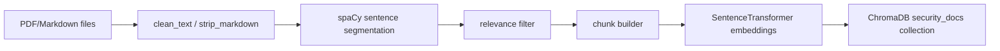
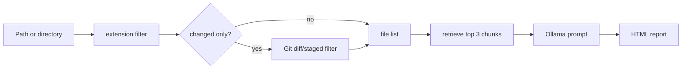

# Architecture

The code is split into a small set of modules:

```text
src/sovereign_rag/
├── cli.py          # unified ingest/query command
├── ingest.py       # PDF/Markdown preprocessing and ChromaDB indexing
├── query.py        # retrieval, Ollama analysis, changed-file filtering
└── html_report.py  # report rendering
```

## Ingest Flow



## Query Flow



## Design Notes

- The vector collection is named `security_docs`.
- Retrieved chunks carry `source` metadata so findings can cite reference documents.
- Query reports are generated after all selected files are processed.
- Changed-file mode is implemented before model initialization so no-op hooks return quickly.
