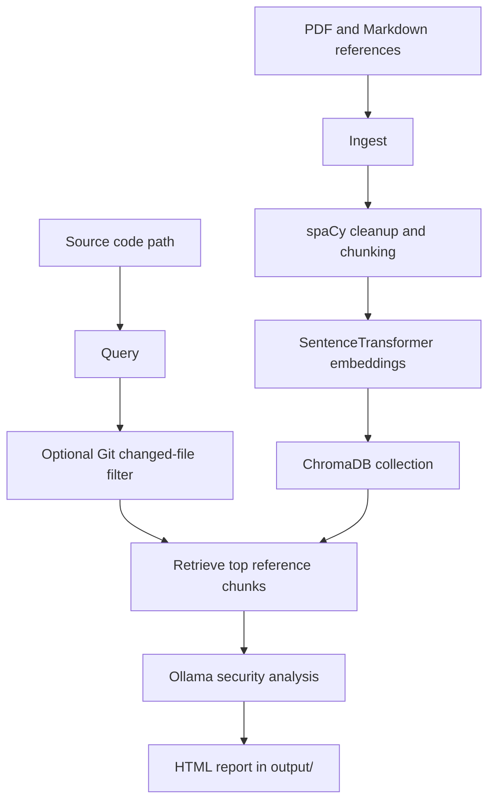

# SovereignRAG

SovereignRAG is a local retrieval-augmented security analysis tool. It indexes trusted security references, retrieves the most relevant chunks for each source file, asks a local Ollama model to review the code, and writes an HTML report with cited reference sources.

<div class="hero-grid">
  <div>
    <h2>Private code review with local models</h2>
    <p>The default workflow runs through Docker Compose, stores embeddings in ChromaDB, and keeps code plus reports on your machine.</p>
    <p><a class="md-button md-button--primary" href="getting-started/quickstart/">Run the quickstart</a></p>
  </div>
  <div class="hero-panel">
    <strong>Core pipeline</strong>
    <ol>
      <li>Index PDF or Markdown security references.</li>
      <li>Analyze one file, a directory, or only changed files.</li>
      <li>Generate a timestamped HTML report.</li>
    </ol>
  </div>
</div>

<div class="metric-row">
  <div class="metric"><strong>Offline-first</strong> Ollama, ChromaDB, spaCy, and local files.</div>
  <div class="metric"><strong>Cited findings</strong> Retrieved source documents are listed per file.</div>
  <div class="metric"><strong>Hook-friendly</strong> Analyze staged or changed files for commit workflows.</div>
</div>

## How It Works



## Main Commands

```bash
make build
make up
make pull-model MODEL=qwen2.5:3b-instruct
make ingest DOCS_DIR=./raw_pdfs MODEL=all-MiniLM-L6-v2
make query QUERY_PATH=./src EXT=py MODEL=qwen2.5:3b-instruct
```

For narrower checks, run only changed files:

```bash
make query QUERY_PATH=./src EXT=py CHANGED_ONLY=1 MODEL=qwen2.5-coder:7b-instruct
```
